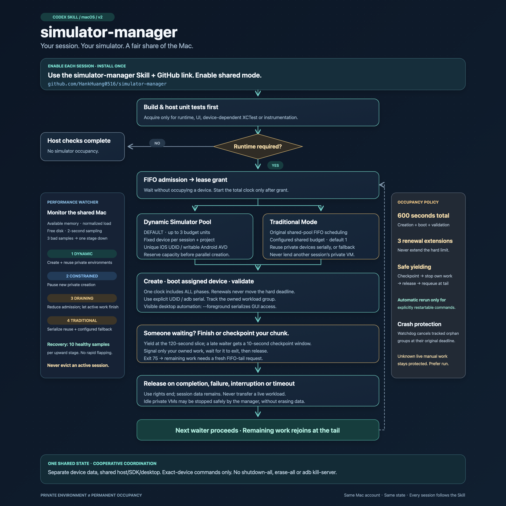
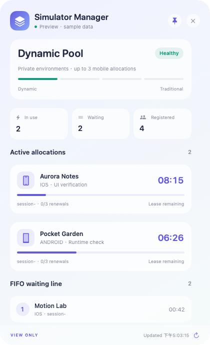

# Simulator Manager Tool

**Your session. Your simulator. A fair share of the Mac.**

A local Codex Tool, Skill and macOS shared resource scheduler. The Tool exposes safe MCP actions while the scheduler enforces ownership, FIFO admission, occupancy deadlines and release. New installations default to **Dynamic Simulator Pool**: each session/project gets its own persistent iOS device or Android writable AVD, created lazily for runtime testing. Host pressure gradually reduces concurrency and falls back to **Traditional Mode**, the original shared-pool FIFO scheduler. Python 3.9+, standard library only.

**Official website:** [eclawbot.com/AiHankApps/tools/simulator-manager](https://eclawbot.com/AiHankApps/tools/simulator-manager/)

## One-command Tool install

```sh
curl -fsSL https://raw.githubusercontent.com/HankHuang0516/simulator-manager/main/install-tool.sh | sh
```

The installer now finishes visibly: it creates **`~/Applications/Simulator Manager.app`**, opens the floating dashboard, and presents a five-step Quick Start. The menu-bar stack icon reopens the panel after it is hidden. If native compilation is unavailable, the CLI and Codex Tool remain installed and the installer prints the exact repair command.

This installs the CLI and Skill in the user account, adds the public `hank-tools` marketplace, and installs the `simulator-manager` Codex Plugin. Start a new Codex task, then say:

> Use simulator-manager for this project.

The Tool provides `simulator_manager_status`, `simulator_manager_enable`, `simulator_manager_run`, `simulator_manager_cleanup`, `simulator_manager_ui`, and `simulator_manager_doctor`. Runtime commands are passed as argv arrays and always execute through the supervised `run` lifecycle.

## Enable with one message

Paste into each Codex session:

> Use the simulator-manager Skill from https://github.com/HankHuang0516/simulator-manager and enable shared mode for this session.

The agent follows [SESSION_START.md](SESSION_START.md), installs the complete CLI once, saves its session label, and uses the same state across projects. No separate terminal step is required from you. Each session must adopt the instruction or the [project rules](AGENTS.example.md).

After registration, the Tool audits the task's process tree before runtime/UI phases. If a registered task directly invokes simulator-facing `simctl`, `xcodebuild`, `adb`, or `emulator` work without a matching lease, it returns targeted coaching and the managed replacement. The watcher stores only a bounded action category and attribution record, never the full command. Coaching never kills a task, simulator, emulator, or adb server. A task that never registers cannot be safely identified from an OS process alone; the dashboard shows only attributable findings rather than guessing.



[Editable SVG](assets/flowchart.svg) · [Accessible flowchart](docs/FLOWCHART.md) · [Complete Skill](skill/simulator-manager/SKILL.md)

## Runtime lifecycle

1. Run builds, static checks and host unit tests first.
2. Request a simulator only for runtime/UI/device-dependent verification.
3. Join FIFO admission, then acquire a private session environment or a Traditional Mode slot.
4. Start one total occupancy clock: **creation + boot + validation**, without resets between phases.
5. Use only the assigned UDID/serial. Keep work within its deadline and renewal allowance.
6. If another session waits, checkpoint/finish your chunk, release, and rejoin at the queue tail for remaining work.
7. Release on success, failure, interruption or timeout. Idle private VMs may be shut down safely; their data and session assignment remain.

Application XCTest targets requiring a simulator and Android instrumented tests require reservations too. Build-for-testing outside the lease where supported, then test-without-building inside it.

## Two modes

| | Dynamic Simulator Pool — default | Traditional Mode |
| --- | --- | --- |
| Environment | Stable private device per session + project + platform | Configured shared pool devices |
| Creation | Lazy, parallel, admission reserved before SDK calls | `setup` creates dedicated fallback slots from installed SDKs |
| Concurrency | Up to `dynamic.max_parallel`, reduced by pressure | Shared weighted `global_capacity` and pool capacities |
| Persistence | Unique iOS UDID / Android AVD and writable directory | Pool device data persists across borrowers |
| Idle behavior | Manager may stop its own **unleased** private VM; no erase | Release leaves the bounded static pool running for reuse |

This is device-data isolation similar to dedicated development environments. It is not Docker/container isolation: sessions still share the host, SDKs, adb server, simulator UI application and foreground desktop. Use device-targeted commands for parallel tests. For visible desktop automation, add **`--foreground`** to the mobile request; foreground requests and the `gui` pool serialize atomically without nested reservations.

Private identity does not mean permanent occupancy. Keep the returned session label stable, including across tool calls. A new label or different project path creates a different environment. At `max_environments`, new owners wait/timeout; existing environments are never silently erased or reassigned. Failed partial creations remain visible and quarantined for operator inspection.

Existing configurations without `mode` retain Traditional Mode. Upgrades preserve configuration. To opt in, drain work, set `"mode": "dynamic"`, and keep every session on version 3.2.0.

## Time limits and fair yielding

New-install defaults:

| Policy | Default | Enforcement |
| --- | --- | --- |
| `max_hold_seconds` | 600 seconds | Includes environment creation, boot and work from lease grant |
| `max_renewals` | 3 actual extensions | No renewal can move the total deadline; no-op renewals do not count |
| `waiter_slice_seconds` | 120 seconds | When another session waits, the current borrower must yield at its slice boundary |
| `yield_grace_seconds` | 10 seconds | If the slice is already used, give a short checkpoint window |
| Termination grace | 3 seconds | SIGTERM to the owned workload group, then SIGKILL if it survives |

`--budget-seconds` requests a shorter total allocation; the configured maximum cannot be bypassed. Queue waiting occurs before the occupancy clock. Phase timeouts can shorten the allocation, never extend it. A fair-yield deadline becomes persistent once a waiter is observed; losing the waiter does not reset it.

Use bounded, restartable test chunks. Scripts should handle SIGTERM by saving a checkpoint and exiting. Cancellation cannot guarantee rollback of arbitrary SDK/application side effects. `run` waits for the complete registered group to exit before releasing; an uninterruptible survivor keeps its reservation. The total **use** deadline is enforced, but safe cancellation/reclamation can take additional time.

Fair yield returns **75** (`requeue_required`); the Skill must request a fresh lease at the tail for remaining validation. For commands explicitly known to be checkpointed/restartable, opt into automatic requeue:

```sh
sim-manager run ios --session my-session --project /absolute/project/path --boot --requeue-on-yield --max-requeues 3 \
  -- ./restartable-ui-test-chunk
```

The limit bounds automatic retries. The manager never assumes an arbitrary command is safe to rerun. A child's own exit code 75 is also treated as a requeue request; reserve that code for this purpose.

Strict time enforcement requires supervised **`run`**. Manual leases expose deadlines and reject expired boot/renew calls; unknown external GUI activity cannot be safely inferred or killed. An expired manual lease with a live owner remains protected until explicitly released. Never kill the long-lived Codex/session owner to recover a slot.

## Gradual performance fallback

A user-local watcher starts during normal activation and dynamic supervised runs. It samples macOS `memory_pressure -Q`, one-minute load divided by logical cores, and free disk. Linux CI uses `/proc/meminfo`. Load ratio measures scheduler load, not instantaneous CPU utilization. Historic swap usage alone does not trigger fallback.

| Stage | Admission behavior |
| --- | --- |
| Dynamic | Allow new private environments; default 3 active budget units |
| Constrained | Pause new private creation; reuse existing private environments or configured fallback slots |
| Draining | Reduce new admissions to half the dynamic limit, minimum 1; use Traditional scheduling |
| Traditional | Use the configured shared budget, default 1; preserve private assignment while serializing reuse |

Each 3 consecutive elevated samples moves one stage down. Defaults: available memory at/below 20%, load ratio at/above 0.85, or disk at/below 5 GiB. Critical thresholds are 10%, 1.25, 2 GiB; a critical sample immediately pauses new private creation, then sustained samples continue the gradual fallback. Unknown memory telemetry is treated conservatively as pressure. Recovery requires 10 consecutive healthy samples for **each** upward stage (memory at least 30%, load ratio at most 0.6, disk above 5 GiB). The 2-second cadence and hysteresis prevent rapid flapping.

Downgrades do not stop active environments or transfer leases. Existing work finishes/yields under the time policy; new admissions wait for the lower limit. At most one idle private VM is considered for retirement per sampling interval. Its manager provenance and lack of a lease are checked before exact-device shutdown. Data is retained. A stopping environment is excluded from acquisition. Failed/ambiguous shutdown stays protected.

When pressure pauses creation, a session without a private environment may use a configured Traditional slot temporarily. Another session's private device is never lent out. Bootstrap prepares fallback slots from installed SDKs; if no safe slot exists, wait/timeout rather than bypass coordination. New VM startup is deferred when free disk is below `monitor.low_disk_gib` (default 5 GiB); already booted, manager-owned devices can be reused. This prevents repeated SDK launches on an exhausted disk. Static fallback VMs can remain booted: host telemetry still governs admission, and limits do not control personal/external VMs.

## Installation

```sh
git clone https://github.com/HankHuang0516/simulator-manager.git
cd simulator-manager
./bootstrap.sh --session my-session --project /absolute/project/path
```

Bootstrap is idempotent and uses a cross-process activation lock. It creates dedicated shutdown fallback devices only from already-installed SDK components. No downloads, personal-device adoption, sudo or shell-profile changes. Missing SDKs are reported; builds can continue outside reservations.

| Item | Default location |
| --- | --- |
| CLI | `~/.local/bin/sim-manager` |
| Program | `~/.local/share/simulator-manager` |
| Skill | `~/.agents/skills/simulator-manager`, or an existing managed legacy Skill |
| Shared state | `~/Library/Application Support/simulator-manager` |

`install.sh` installs without session activation; its legacy Skill default is `${CODEX_HOME:-~/.codex}/skills`. Pass `--skill-dir "$HOME/.agents/skills"` to choose the user discovery directory. The installed Skill records absolute CLI/state paths. [Official Skill documentation](https://learn.chatgpt.com/docs/build-skills)

```sh
./bootstrap.sh --session my-session --prefix /path/to/program --bin-dir /path/to/bin \
  --skill-dir /path/to/skills --state-dir /path/to/shared-state
./bootstrap.sh --session my-session --no-prepare  # No fallback setup/watcher activation
./bootstrap.sh --upgrade  # Drain leases/queues and pause new callers first
```

All sessions must use the same state/config, including a custom `--state-dir` or `SIM_MANAGER_STATE_DIR`. Config changes apply after leases/queues drain. Busy inconsistent acquisitions fail; release/status/cleanup can recover with the saved database config if the config file is missing or malformed. Upgrade uses the incoming version to stop the verified managed watcher before replacing code; watcher identity protocol checks also restart an older watcher before it can interpret new leases. The installer refuses busy or unmanaged installations.

## Android transport readiness

Version 2.0.3 retries read-only ADB inventory, AVD-name and boot-property queries within the original boot deadline. A disconnected console is never treated as permission to skip an unknown emulator: every listed emulator must be identified and the inventory re-enumerated before attachment or launch. Exiting occupied ports are awaited without stopping a process; persistent ambiguity blocks the workload and supervised release still applies. Known duplicate AVDs, foreign target identities and external runtime attachment remain rejected. No shared ADB server restart, data clearing or policy extension is performed. This addresses transient readiness failures after genuine retirement; it does not establish the source or resolution of shared ADB remote-stop requests.

## Warm environment reuse

Version 2.0.2 prioritizes a queued request for its own running private environment before idle retirement. A queue entry or a degraded stage alone no longer causes shutdown. Maintenance reclaims an unleased private VM when running occupancy exceeds admission capacity, a FIFO-head cold environment needs a slot, critical host telemetry requires relief, or the configured idle timeout expires. Pending matching warm requests remain protected. Each maintenance tick retires at most one provenance-verified VM and retains its installed apps/userdata. Lease release and VM shutdown remain separate: fair yielding gives up use rights without necessarily restarting the device. Sessions must release without running `simctl shutdown`, `adb emu kill`, emulator-close actions, or shutdown cleanup traps; the manager alone decides when an unleased device is reused warm or safely retired.

## CLI examples

Pass the same canonical `--project` on every acquire/run. If omitted, the current working directory is used; session registration does not restore a saved project. Keep `--mode auto` to reuse your private environment during pressure-driven Traditional admission. Explicit `--mode traditional` selects the static pool instead.

```sh
# Host build and unit tests first; runtime work only inside the lease.
sim-manager run ios --session my-session --project /absolute/project/path --boot --budget-seconds 600 -- sh -eu -c '
  xcodebuild test-without-building -scheme MyApp -destination "id=$SIM_MANAGER_UDID"
'
sim-manager run android --session my-session --project /absolute/project/path --boot -- sh -eu -c '
  adb -s "$SIM_MANAGER_SERIAL" install -r app/build/outputs/apk/debug/app-debug.apk
  adb -s "$SIM_MANAGER_SERIAL" shell am start -n com.example.app/.MainActivity
  adb -s "$SIM_MANAGER_SERIAL" exec-out screencap -p > screenshot.png
'
sim-manager run ios --session my-session --project /absolute/project/path --foreground --boot -- ./visible-ui-test
sim-manager run gui --session my-session -- ./desktop-test
sim-manager run ios --mode traditional --session my-session --boot -- ./device-test
sim-manager enable --session my-session --prepare --json
sim-manager setup all --json
sim-manager status --json
sim-manager cleanup --json
sim-manager watch --once --json
sim-manager watch --stop --json
sim-manager validate-config --json
sim-manager discover ios --json
sim-manager discover android --json
```

Add meaningful project-specific assertions. Some Gradle connected-test tasks enumerate every device; use an explicitly targeted instrumentation runner. `--mode dynamic` cannot override telemetry/admission limits. Avoid nested reservations.

`run` injects `SIM_MANAGER_TOKEN`, `SIM_MANAGER_RESOURCE_ID`, `SIM_MANAGER_POOL`, `SIM_MANAGER_SESSION`, `SIM_MANAGER_UDID`, `SIM_MANAGER_SERIAL`, `SIM_MANAGER_AVD`, and `SIM_MANAGER_HARD_EXPIRES`. Expand device values inside the child after acquisition. `--timeout` limits queue waiting; `--boot-timeout` and `--command-timeout` limit phases within the total deadline.

### Manual leases and outputs

Prefer `run`. A manual lease spanning tool calls requires a verified long-lived owner PID, synchronous work, deadline checks and guaranteed release:

```sh
set -eu
lease_env=$(sim-manager acquire ios --owner-pid "$$" --session my-session --shell)
eval "$lease_env"
trap 'sim-manager release "$SIM_MANAGER_TOKEN" >/dev/null' EXIT
trap 'exit 130' INT TERM HUP
sim-manager boot "$SIM_MANAGER_TOKEN"
# Synchronous device-targeted work; finish within the reported deadline.
sim-manager renew "$SIM_MANAGER_TOKEN" --lease-seconds 120 --json
sim-manager release "$SIM_MANAGER_TOKEN" --json
```

Only evaluate `--shell` output. Tokens are private capabilities, never resource IDs or session names. Release is retry-safe and refuses live registered work. `status` omits tokens and reports owner/project/session, occupancy deadlines, renewal count, ordered queue, environment identity/phase and host controller metrics.

`--json` writes one object to stdout; `run --json` sends child output to stderr and returns `exit_code`, `released`, `mode`, `requeues`, `requeue_required`. Normal output is formatted JSON. `--shell` writes quoted acquisition/renewal exports, including occupancy deadlines. Errors carry `error` and `code`.

| Exit | Meaning |
| --- | --- |
| 0 | Success |
| 1 / 2 | Configuration/SDK/general error / CLI usage error |
| 3 | Queue timeout; `--timeout 0` tries once without jumping FIFO |
| 4 | Token/owner/expiry/renewal or active-work restriction |
| 75 | Safe yield; release and request remaining work again at the tail |
| 124 | Total or phase timeout |
| 130 | Interrupted manager |
| Other | Child exit code; signals map to 128 + signal |

## Configuration and recovery

[Default config](config/default.json) · [Configurable pool example](config/example.json) · [No-SDK Traditional demo](config/demo.json)

`mode`, `dynamic`, `policy`, and `monitor` configure the behavior above. Per-pool `capacity: 0` pauses both modes. Traditional `capacity` bounds that pool's leases and `global_capacity` bounds weighted concurrent leases. Dynamic mobile admission uses `max_parallel` and one private slot per session; static resource `cost` defaults to 1. Resource IDs, iOS UDIDs, Android AVDs and ports must be globally unique across static pools. Dynamic Android ports are transactionally reserved across static and private environments before parallel SDK creation.

Android requires an installed host-compatible system image, `adb`, `emulator`, and `avdmanager`. Each private environment has a unique writable AVD and `environments/<identity>/avds/` directory. Tools use configured `tools` paths, PATH, or `android_sdk` / standard SDK locations. Arbitrary emulator arguments are rejected; device targets remain pinned. iOS creates a unique device from an installed available runtime and compatible iPhone type.

SQLite `BEGIN IMMEDIATE`, WAL and FULL synchronous protect allocation, queue and ownership state across sessions. FIFO is strict within a pool; across pools the oldest satisfiable head progresses. Parallel private creation reserves capacity in FIFO admission order, although SDK creation may complete in a different order. The pipe gate registers each workload group before execution.

Dead waiters are reaped. A dead owner with no live tracked work is reclaimed. After supervisor SIGKILL, the watcher keeps the live group reserved until it ends or the original deadline requires cancellation of **that owned group**. The macOS kernel boot-session UUID stays stable across timezone/NTP changes; PID start stamps use UTC. Host reboot invalidates these process identities and running flags. Legacy clock-based identities with a live PID/group are quarantined if ambiguous rather than recycled. A live owner with unknown manual work is never stolen merely because its lease expired.

Watcher state is local and user-owned; `flock` prevents duplicate watchers. If it crashes, the next activation/dynamic run restarts it. `watch --once` and `cleanup` perform maintenance manually. `monitor.daemon: false` disables background start; supervised runs still enforce their own policy and sample pressure. Idle maintenance reserves a stopping row before SDK calls. Partial creation remains quarantined. Interrupted idle shutdown is retried only after the verified stopping process dies, with runtime provenance checked again.

Never use `booted`, implicit adb targets, `shutdown all`, `erase all`, `adb kill-server`, or stop another session's active VM. Only the manager's idle maintenance may stop a provenance-verified unleased private device by exact identifier. No erase/reset/personal-device deletion is implemented.

One Mac account and local storage only; do not put the shared database on NFS/iCloud. This is cooperative coordination, not interception of arbitrary SDK callers. Process-group escape, external automation workers and rare ambiguous PID reuse remain outside strict protection. Do not delete state while workers run.

[Apple CLI reference](https://developer.apple.com/documentation/xcode/xcode-command-line-tool-reference) · [Android emulator and writable AVD data](https://developer.android.com/studio/run/emulator-commandline) · [ADB](https://developer.android.com/tools/adb) · [avdmanager](https://developer.android.com/tools/avdmanager)

## Android target compatibility and recovery

Some installed `avdmanager` versions create `target=android-0` for Major.Minor images such as Android 36.1. That can disable HVF on Apple Silicon even when hardware acceleration checks and vendor entitlements pass. New AVD creation now validates local manifests and writes an integer root API target (`android-36`) while preserving the exact 36.1 system image and device data. Image selection compares numeric major/minor/extension versions. [Official QEMU API parsing](https://android.googlesource.com/platform/external/qemu/+/refs/heads/emu-master-dev/android/emu/avd/src/android/avd/info.c), [official arm64 HVF gate](https://android.googlesource.com/platform/external/qemu/+/refs/heads/emu-32-release/android-qemu2-glue/main.cpp).

Boot fails before launching a VM if an explicitly assigned AVD manifest has a missing, zero or unparseable numeric target. Existing private AVDs are **not rewritten in the background**. The owner can request metadata-only recovery while holding a valid lease, before any VM or tracked work starts:

```sh
set -eu
eval "$(sim-manager acquire android --session '<saved-label>' --project '/saved/absolute/project/path' --owner-pid "$$" --budget-seconds 60 --shell)"
trap 'sim-manager release "$SIM_MANAGER_TOKEN" >/dev/null' EXIT
trap 'exit 130' INT TERM HUP
sim-manager repair-android-target "$SIM_MANAGER_TOKEN" --json
sim-manager boot "$SIM_MANAGER_TOKEN" --timeout 40
```

Repair requires the assigned private environment, no running VM or tracked work, free pinned ports and an installed image under the configured SDK with valid API metadata. It preserves userdata/configuration/image files and changes only the root manifest target atomically. It refuses static/external resources and ambiguous activity. The original use deadline and renewal count remain intact. Never repair another session's AVD or change SDK security/signatures as a workaround.

## Floating dashboard

On macOS 13 or later, the one-command installer opens the dashboard automatically and adds **Simulator Manager** to `~/Applications`. You can also tell Codex **“Open the simulator-manager dashboard.”** The agent runs:

```sh
sim-manager ui
```

To recreate the application entry and replay onboarding:

```sh
sim-manager ui --install-app --onboarding
```

The first launch compiles a small native SwiftUI app with the installed Xcode command line tools. Subsequent launches open immediately. No packages, web service, account or additional permissions are required. The compiled app is also directly clickable at `<install-prefix>/Simulator Manager.app`.

The iOS-inspired floating panel shows live admission mode, active allocations and effective lease countdowns, FIFO requests and wait time, registered sessions, private environments, host pressure, recent activity, and a Guidance Center for active compliance coaching. The globe menu switches among **Automatic (Device)**, **English**, and **中文**; Automatic is the persisted default and follows the first preferred macOS language. Dashboard text, Quick Start, guidance, status labels and menu-bar commands change immediately. The question-mark button replays the five-step Quick Start. It refreshes every two seconds without overlapping requests. CPU shows normalized load per core, not CPU utilization. “Registered” means adopted the Skill; it does not claim a task is currently running.

Pin/unpin the window, drag its background, resize it, or close it to hide. Reopen from the menu-bar stack icon; choose **Quit Dashboard** to exit. The manager watcher continues when the dashboard is hidden or closed. The panel observes the existing status API and offers no release, shutdown, cancellation or configuration controls. Status retains its normal safe housekeeping behavior. Custom installations use `sim-manager ui --state-dir /shared/path`; a directly opened app uses `SIM_MANAGER_STATE_DIR` or the default state. Quit and reopen before switching state directories.



## Tests

```sh
python3 -m unittest discover -s tests -v
python3 -m compileall -q sim_manager tests activate.py install.py
```

Tests use isolated temporary state and fake SDK executables. They cover static FIFO/exclusion, parallel private creation, stable identities, private Android data/ports, total time including boot, bounded renewals, checkpoint yielding/requeue, gradual pressure/recovery, owned idle shutdown, crash/watchdog recovery, bootstrap and installation. [Validation report](VALIDATION.md) distinguishes simulated SDK tests from actual host verification. MIT licensed.

## Unity ADB compatibility

Unity may automatically stop shared ADB on Editor exit or terminate servers from another SDK, including during host-only work. Coordinate an Editor-idle window to disable both automatic termination controls; see [Unity guidance](skill/simulator-manager/references/unity.md). Bootstrap does not alter these user preferences. Share sanitized Unity failure logs, since error blocks can dump process environment values.
