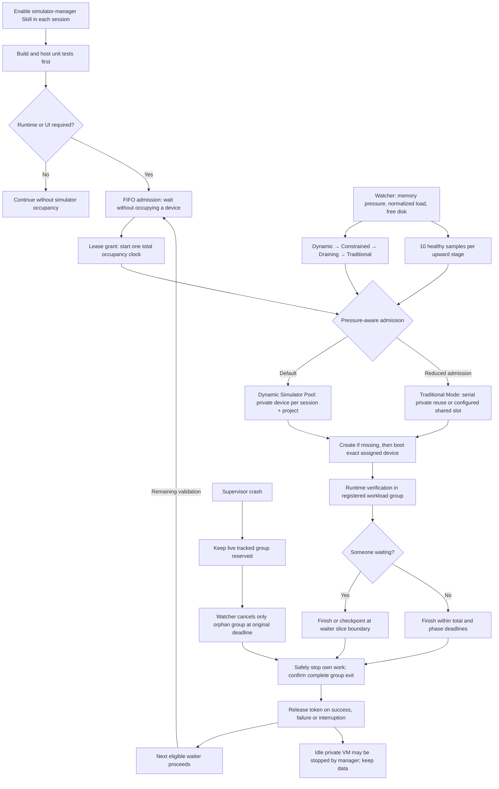

# Dynamic Simulator Pool workflow

[Full-resolution PNG](../assets/flowchart.png) · [Editable SVG](../assets/flowchart.svg)

Defaults: total use budget 2400 seconds (40 minutes) including creation + boot + installation + validation + export; at most 3 actual extensions; waiter slice 120 seconds and late checkpoint window 10 seconds. A 1800-second soak fits only while no waiter arrives. Expired leases cannot be revived. Exit 75 requires remaining work to requeue at the FIFO tail; automatic rerun is opt-in for explicitly restartable commands only.

Pressure uses 2-second sampling and 3 elevated samples per downward step; critical telemetry immediately pauses new private creation. New private creation pauses first, then admissions reduce and Traditional scheduling applies. Active environments are never evicted. Only provenance-verified unleased private VMs can be stopped by exact identifier, at most one per sampling interval. Private assignment/data persists; another session never receives it.

Supervised run enforces policy. Unknown live manual work stays protected; cancellation cannot promise arbitrary side-effect rollback. Device-data isolation shares the Mac host, SDKs and desktop. Foreground mobile requests use `--foreground`, avoiding nested GUI reservations.
