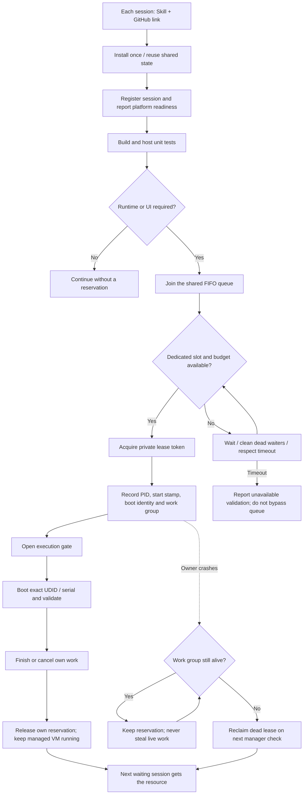

# Shared resource workflow

The [SVG](../assets/flowchart.svg) is editable; the [PNG](../assets/flowchart.png) is optimized for GitHub display.

FIFO is strict within a pool; the oldest satisfiable pool head is chosen across pools. Live-owner TTL expiry prevents new work but retains its reservation. Activation records cooperative intent and never reserves a device by itself.
