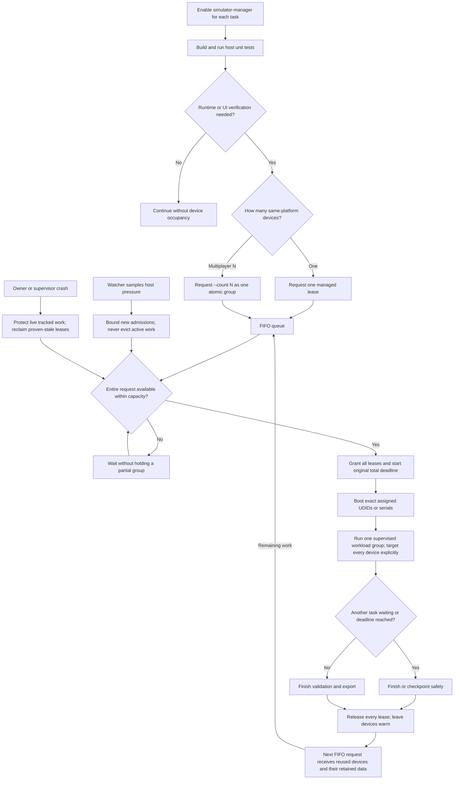

# Warm shared pool workflow

The default is a bounded shared FIFO pool. A same-platform multiplayer request obtains its whole group at once, or waits without occupying a partial set. One maximum 2400-second occupancy deadline includes boot, installation, validation and export; at most three actual renewals stay inside that deadline. A waiting task triggers a 120-second fair-use slice and a bounded 10-second late checkpoint window. Exit 75 requires remaining work to requeue at the FIFO tail. The manager, not a task, may retire an unleased device for a real capacity or critical-pressure need. Releasing use rights does not shut down the device or erase its apps/data.

Optional Dynamic private environments remain available for installations that deliberately enable that mode. They are never lent to another task. Migration to shared mode and private cleanup require zero leases and FIFO waiters; ambiguous or live private devices stay protected.
